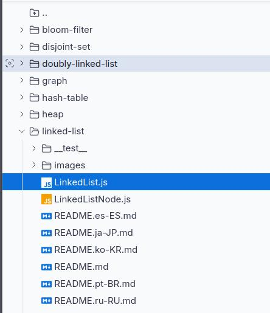

#+TITLE: Save a locally documents
#+author: Konrad Geletey (matrix:@kglt:re128.org)

* Explain the problem as you see it

Now you can only edit the documents and there is now way to return to them after the closing of the browser.

* Suggest a solution

There is a documentation on the use of a special [[https://wxt.dev/storage.html][WXT Storage]]

Using it, create in indexdb storage and put documents there.
When you open browser, from storage we take data and show
If user is a some docs, then it should be possible showing it in tree files view, by analogy with

Two more features, which must be implemented:

** Folders and switching between them, as in realized in [[https://sourcegraph.com/search][Sourcegraph]]
** Filter files, as a [[https://chat.qwen.ai][qwen.chat]]

* Release
  DEADLINE: <2025-04-06 Sun>

